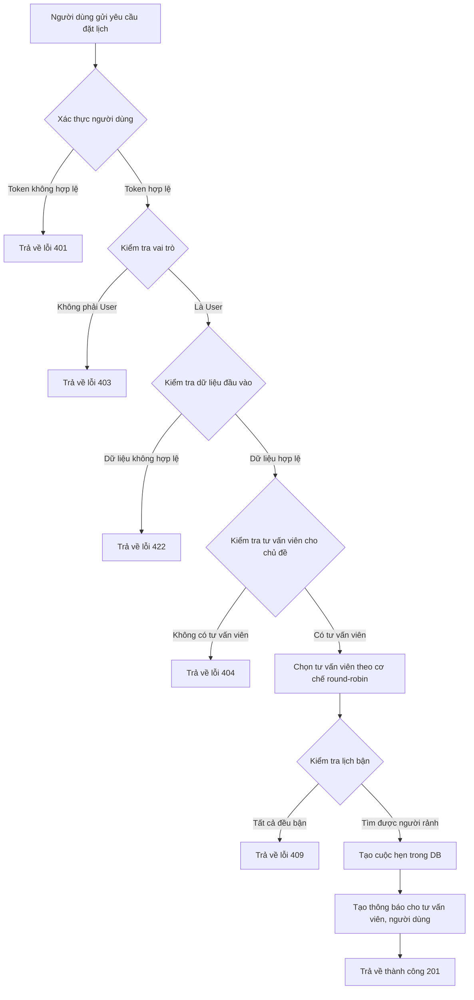

# 📅 API: Đặt Cuộc Hẹn (Book Appointment)

## 🧾 Thông tin cơ bản

- **Phương thức**: `POST`
- **Đường dẫn**: `/appointment/book`
- **Mô tả**: Cho phép người dùng đặt cuộc hẹn với tư vấn viên
- **Vai trò được phép**: `User` (Người dùng thông thường)

---

## 📦 Request Body

```json
{
  "topic": "enum_topic",
  "booking_date": "Date",
  "time_slot": "string"
}
```

- `topic`: Chủ đề cuộc hẹn (giá trị thuộc `enum Topic`)
- `booking_date`: Ngày đặt lịch (định dạng ngày `YYYY-MM-DD`)
- `time_slot`: Khung giờ đặt lịch
  - Ví dụ: `"SLOT_08_10"`, `"SLOT_10_12"`, `"SLOT_13_15"`, `"SLOT_15_17"`

---

## 🧭 Flowchart – Luồng xử lý đặt cuộc hẹn



---

## 🔁 Luồng xử lý

### 1. 🚫 Middleware

#### 1.1. `accessTokenValidator`

- **Chức năng**: Xác thực token truy cập của người dùng
- **Xử lý**:
  - Kiểm tra header `Authorization` có token hợp lệ không
  - Xác minh token có hợp lệ và chưa hết hạn
  - Giải mã token → lưu vào `req.decode_authorization`
  - Nếu token không hợp lệ → trả về `401 Unauthorized`

#### 1.2. `requireRole(USER_ROLE.User)`

- **Chức năng**: Kiểm tra vai trò người dùng
- **Xử lý**:
  - Kiểm tra role đã giải mã từ token
  - Nếu không phải `User` → trả về `403 Forbidden`

#### 1.3. `bookAppointmentValidator`

- **Chức năng**: Xác thực dữ liệu đầu vào
- **Xử lý**:
  - Kiểm tra `topic`, `booking_date`, `time_slot` có tồn tại
  - `topic` thuộc enum hợp lệ
  - `booking_date` là ngày hợp lệ và trong tương lai
  - `time_slot` nằm trong danh sách khung giờ hợp lệ
  - Nếu không hợp lệ → `422 Unprocessable Entity`

---

### 2. ♻️ Controller: `bookAppointmentController`

- Lấy thông tin người dùng từ token đã giải mã (`user_id`)
- Lấy `topic`, `booking_date`, `time_slot` từ request body
- Gọi service để lấy số lượng tư vấn viên có sẵn cho chủ đề
  (`questionServices.getNumberOfConsultantsByTopic`)
  - Nếu không có tư vấn viên → `404 Not Found`
- Phân phối tư vấn viên theo round-robin bằng Redis
  - Lấy chỉ số tiếp theo với `redisUtils.getIndexNextConsultantForBookingAppointment`
  - Kiểm tra lịch bận với `appointmentServices.checkAppointmentExists`
  - Nếu có người phù hợp:
    - Cập nhật chỉ số tư vấn viên tiếp theo trong Redis (`redisUtils.setNextConsultantIndex`)
    - Tạo cuộc hẹn mới với thông tin tư vấn viên được chọn (`appointmentServices.createAppointment`)
    - Thêm thông báo cho tư vấn viên, customer về cuộc hẹn (`notificationService.addNotificationForConsultantAppointment`)
  - Nếu không có người nào rảnh → `409 Conflict`
- Trả về `201 Created` nếu thành công

---

### 3. 🔧 Service

#### 3.1. questionServices.getNumberOfConsultantsByTopic

**Chức năng:** Lấy số lượng tư vấn viên có thể tư vấn về chủ đề cụ thể
**Xử lý:**

- Truy vấn cơ sở dữ liệu để đếm số tư vấn viên có chuyên môn về chủ đề được chọn
- Trả về số lượng tư vấn viên

#### 3.2. redisUtils.getIndexNextConsultantForBookingAppointment

**Chức năng:** Lấy chỉ số của tư vấn viên tiếp theo từ Redis theo cơ chế round-robin
**Xử lý:**

- Kiểm tra trong Redis xem chỉ số của tư vấn viên tiếp theo cho chủ đề này
- Nếu chưa có, thiết lập giá trị ban đầu là 0
  Trả về chỉ số để sử dụng

#### 3.3. usersServices.getConsultantByTopicAndIndex

**Chức năng:** Lấy ID của tư vấn viên dựa trên chủ đề và chỉ số
**Xử lý:**

- Truy vấn cơ sở dữ liệu để lấy danh sách tư vấn viên theo chủ đề
- Sắp xếp và chọn tư vấn viên theo chỉ số được cung cấp
- Trả về ID của tư vấn viên

#### 3.4. appointmentServices.checkAppointmentExists

**Chức năng:** Kiểm tra xem tư vấn viên có bận trong khung giờ cụ thể không
**Xử lý:**

- Truy vấn cơ sở dữ liệu để kiểm tra xem tư vấn viên có cuộc hẹn nào trong khung giờ đó chưa
- Trả về true nếu tư vấn viên đã có lịch, false nếu còn trống

#### 3.5. redisUtils.setNextConsultantIndex

**Chức năng:** Cập nhật chỉ số của tư vấn viên tiếp theo trong Redis
**Xử lý:**

- Lưu chỉ số mới vào Redis để sử dụng cho lần đặt lịch tiếp theo
- Đảm bảo cơ chế round-robin hoạt động đúng

#### 3.6. appointmentServices.createAppointment

**Chức năng:** Tạo bản ghi cuộc hẹn mới trong cơ sở dữ liệu
**Xử lý:**

- Lưu thông tin cuộc hẹn (người dùng, tư vấn viên, chủ đề, ngày, khung giờ)
- Thiết lập trạng thái mặc định là "chờ xác nhận"
- Trả về thông tin cuộc hẹn đã tạo bao gồm ID

#### 3.7. notificationService.addNotificationForConsultantAppointment

**Chức năng:** Tạo thông báo cho tư vấn viên về cuộc hẹn mới
**Xử lý:**

- Tạo bản ghi thông báo trong cơ sở dữ liệu
- Lưu thông tin vào Redis để gửi thông báo thời gian thực nếu tư vấn viên đang online
- Đặt lịch gửi nhắc nhở trước thời điểm cuộc hẹn 30 phút

---

## 📤 Phản hồi

### ✅ Thành công

```json
Status: 201 Created
{
  "message": "BOOKING_CREATED_SUCCESSFULLY"
}
```

### ❌ Lỗi

#### Không có tư vấn viên cho chủ đề

```json
Status: 404 Not Found
{
  "message": "TOPIC_DO_NOT_HAVE_CONSULTANT"
}
```

#### Không có tư vấn viên rảnh

```json
Status: 409 Conflict
{
  "message": "NO_AVAILABLE_CONSULTANT"
}
```

#### Dữ liệu không hợp lệ

```json
Status: 422 Unprocessable Entity
{
  "message": "Validation Error",
  "errors": {
    "topic": "TOPIC_IS_INVALID",
    "booking_date": "BOOKING_DATE_MUST_BE_IN_FUTURE",
    "time_slot": "TIME_SLOT_IS_INVALID"
  }
}
```
